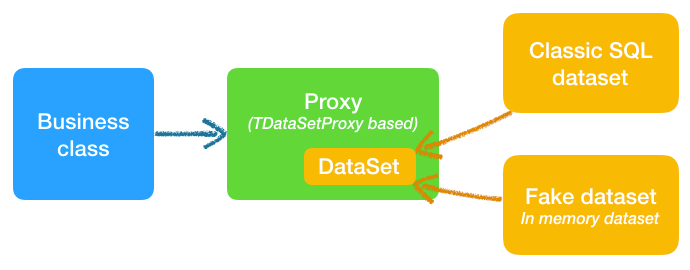

# DataProxy Pattern for Delphi


## Overview

TDataSetProxy is a wrapper component for the classic Delphi dataset component. It allows to replace any dataset with a fake dataset (in-memory table). Proxy can be used to separate a business class from datasets, this separation is helpful when the business code needs to be putted into automated test harness (unit tests).



**Inspiration**. Idea is based on Proxy GoF pattern and Active Record pattern, defined by Martin Fowler in book **Patterns of Enterprise Application Architecture**

## Why using proxy?

DataSet Proxy pattern is helpful during the business logic extraction. This could be especially useful for improving legacy, highly coupled projects. When production code is dependent on a SQL data and SQL connection, it's really difficult to write unit tests for such code.

Replacing dataset with proxies introduce new abstraction level which can facilitate both: SQL datasets in production code and memory datasets in test project. Proxy has very similar interface (methods list) to classic dataset, which help in easy migration. Fake datasets will allow to verify (assert) production code without connecting to database.

DataSet Proxy together with two companion projects (DataSet Generator, Delphi Command Pattern) gives developers opportunity to introduce unit tests with with safe refactorings. 

Dataset proxy is a temporary solution and after covering code with the tests engineers can apply more advanced refactorings: decoupling code or make it more composable and reusable. As one of these refactorings proxy can be safely replaced by the DAO object or by the model data structures.

Together with code and quality improvement developers will learn how to write cleaner code or how to use test first approach and work better.

Supportive project:

| Project | GitHub Repo |
| --- | --- |
| DataSet Generator | https://github.com/bogdanpolak/dataset-generator |

## Proxy generation

Project includes source code of base class `TDataSetProxy` and two different types of proxy generators:

1) Component: **TDataProxyGenerator**
   - unit `src/Comp.Generator.DataProxy.pas`
   - As an input receives dataset and as an output generates source code: unit containing proxy class inherited from `TDataSetProxy`
2) Tool: **Generator App for FireDAC**
   - tool source: `tools/generator-app`
   - VCL Forms application written in Delphi which is able to connect to SQL server via FireDAC, then prepare SQL command, fetch result dataset and generate proxy class together with dataset fake

### Component

Component `TDataProxyGenerator` is useful when engineer wants to generate proxy for exiting dataset in production code. This is two steps easy task: (1) add component unit to uses section, (2) find code using dataset and call generator method:

Current production code:

```pas
aBooksDataSet := fDBConnection.ConstructSQLDataSet(
  aOwner, APPSQL_SelectBooks);
dbgridBooks.DataSource.Dataset := aBooksDataSet;
```

Injected generator code:

```pas
TDataProxyGenerator.SaveToFile('../../src/Proxy.Books',
  aBooksDataSet, 'TBookProxy');
```

### Tool

**Generator App for FireDAC** is alternative tool created mostly for demo purposes. In practice using this tool can be less useful then using directly the component generator. Generator App is dedicated  for coaching and training purposes. For more information check: [Generator App for FireDAC - User Guide](doc/generator-app-guide.md).
  
## Sample proxy class

```pas
type
  TBookProxy = class(TDatasetProxy)
  private
    fISBN :TWideStringField;
    fTitle :TWideStringField;
    fReleseDate :TDateField;
    fPages :TIntegerField;
    fPrice :TBCDField;
  protected
    procedure ConnectFields; override;
  public
    property ISBN :TWideStringField read fISBN;
    property Title :TWideStringField read fTitle;
    property ReleseDate :TDateField read fReleseDate;
    property Pages :TIntegerField read fPages;
    property Price :TBCDField read fPrice;
  end;

procedure TBookProxy.ConnectFields;
begin
  Assert(fDataSet.Fields.Count = 5);
  fISBN := fDataSet.FieldByName('ISBN');
  fTitle := fDataSet.FieldByName('Title');
  fReleseDate := fDataSet.FieldByName('ReleseDate');
  fPages := fDataSet.FieldByName('Pages');
  fPrice := fDataSet.FieldByName('Price');
end;
```

## TDataSetProxy class

DataSetProxy component is a proxy class, which has almost identical methods to classic TDataSet component. Developer can easily replace any DataSet component with this proxy applying only few and low risk changes to the production code. From the production code point o view change is small small and not much important but from the testing perspective this is fundamental change, because developer is able to reconfigure proxy to use lightweight memory dataset.

Most of the `TDataSetProxy` methods are just clones of TDataSet once. You can easily expand set of this methods adding missing once or build new unique ones. This proxy methods are: `Append`, `Edit`, `Cancel`, `Delete`, `Close`, `Post`, `RecordCount`, `First`, `Last`, `Eof`, `Next`, `Prior`, `EnableControls`, `DisableControls`, `Locate`, `Lookup`, `Refresh` and others. Documentation and this methods usage is the same like standard Delphi documentation for `TDataSet` class.

Rest of `TDataSetProxy` methods can be divided into two groups: proxy setup methods (configuration) and proxy helper methods (expanding classic dataset functionality).

### TDataSetProxy setup

```pas
procedure TDataModule1.OnCreate(Sender: TObject);
begin
  fOrdersProxy := TOrdersProxy.Create(fOwner);
  fOrdersDataSource := fOrdersProxy.ConstructDataSource;
end;

procedure TDataModule1.InitOrders(aYear, aMonth: word);
begin
  fOrdersProxy.WithFiredacSQL( FDConnection1,
    'SELECT OrderID, CustomerID, OrderDate, Freight' +
    ' FROM {id Orders} WHERE OrderDate between' +
    ' :StartDate and :EndDate', 
    [ GetMonthStart(aYear, aMonth), 
      GetMonthEnd(aYear, aMonth) ],
    [ftDate, ftDate])
    .Open;
  fOrdersInitialized := True;
end;

procedure TDataModule1.InitOrders(aDataSet: TDataSet);
begin
  fOrdersProxy.WithDataSet(aDataSet).Open;
  fOrdersInitialized := True;
end;
```

### DataSetProxy helpers

Current release of `TDataSetProxy` component is containing only one helper methods which was implemented as an example. Developers are able to expand this collection according to the team coding practices. Suggested of expanding proxy class is using the inheritance. Sample usage of existing `ForEach` helper method:

```pas
function TDataModule.CalculateTotalOrders (const aCustomerID: string): Currency;
begin
  Result := 0;
  procedure ForEach(OnElem: TProc);
  fOrdersProxy.ForEach(procedure
    begin
      if fOrdersProxy.CustomerID.Value = aCustomerID then
        Result := Result + fOrdersProxy.GetTotalOrderValue;
    end;
end;
```

## Why engineers need to change?

This project is effect of many years and multiple teams experience. This teams found that classic event based Delphi approach is not only less productive, but even dangerous for the developers, the managers and for the customers.

Working with RDBMS (SQL servers) in Delphi looks to be very productive and simple. Developer drops a `Query` component, enters SQL command, sets Active property, connects all DB-aware controls to query and you are done ... almost done, almost but actually far from being ready to deliver application. 

Using this simple visual pattern developer can expose and modify SQL server data extremely quickly. In reality what looks simple at the begging, latter becomes challenging. Within time engineers create more and more datasets and events, defragmenting business flow and mixing presentation, configuration and domain code. Project becomes more and more messy and coupled. After some years managers and developers lose control over such project: plans and deadlines are not possible to quantify, customers are struggling with unexpected and strange bugs, simple changes require many hours of work.

- **Pros of classic even approach**:
   - Intuitive
   - Easy to learn
   - Productive (in initial phases)
   - Easy prototyping
   - Easy to debug
- **Cons of classic approach**:
   - Messy code
   - Almost no architectural design
   - Massive copy-paste development - difficult to reuse code
   - Mixing layers - manipulation of user controls along with business logic and data in a single class or even in a single method
   - High technical debt
   - Stagnation and team demotivation - developers aren’t motivated to learn, improve and change
   - No or minimalistic unit test coverage

## Modernizing VCL projects in action

Replacing classic dataset with proxy requires some time to learn and validate in action. This approach could looks a little strange for Delphi developers, but is easy to adopt and learn. With management motivation and senior engineer coaching team will faster adopt code extraction and replacing datasets with proxies technique.

Defined here proxy approach is a simple and safe refactoring technique dedicated for classic VCL application builded in EDP (Event Driven Programming) way. Using this solution in evolution way small, but important parts of business code can be extracted and covered with unit tests. After some time, with a better safety net (unit tests coverage), engineers can swap proxies with OOP DAOs and improve code more using advanced refactorings and architectural patterns.

The modernization process includes following steps: 
1. Business code extraction
1. Proxy generation
1. Dataset replacement with the proxy
1. Unit test introduction
1. Decomposition (big methods into smaller once) with unit test coverage
1. New composable classes creation (unit tests)
1. Proxy retirement (to replace with DAO)

## Code evolution with proxy

Look at example showing the migration path of a legacy VCL project using a TDataSetProxy. We'll start with the classic method defined in the form:

```pas
procedure TFormMain.LoadBooksToListBox();
var
  aIndex: integer;
  aBookmark: TBookmark;
  aBook: TBook;
  isDatePrecise: boolean;
begin
  ListBox1.ItemIndex := -1;
  for aIndex := 0 to ListBox1.Items.Count - 1 do
    ListBox1.Items.Objects[aIndex].Free;
  ListBox1.Clear;
  aBookmark := fdqBook.GetBookmark;
  try
    fdqBook.DisableControls;
    try
      while not fdqBook.Eof do
      begin
        aBook := TBook.Create;
        ListBox1.AddItem(fdqBook.FieldByName('ISBN').AsString + ' - ' +
          fdqBook.FieldByName('Title').AsString, aBook);
        aBook.ISBN := fdqBook.FieldByName('ISBN').AsString;
        aBook.Authors.AddRange(BuildAuhtorsList(
          fdqBook.FieldByName('Authors').AsString));
        aBook.Title := fdqBook.FieldByName('Title').AsString;
        aBook.ReleaseDate := ConvertReleaseDate(
          fdqBook.FieldByName('ReleaseDate').AsString);
        aBook.Price := fdqBook.FieldByName('Price').AsCurrency;
        aBook.PriceCurrency := fdqBook.FieldByName('Currency').AsString;
        ValidateCurrency(aBook.PriceCurrency);
        fdqBook.Next;
      end;
    finally
      fdqBook.EnableControls;
    end
  finally
    fdqBook.FreeBookmark(aBookmark);
  end;
end;
```

> **Notice!** Presented above solution is a bad practice, but unfortunately is often used by Delphi developers. Goal of using TDataProxy is to improve this state and separate business logic from visualization.

This method is loading data from SQL database, using `fdqBook` TFDQuery. An object of class `TBook` is created for each row, its fields are filled with data set values and validated. Because `TBook` objects are stored in the `TListBox` control, which also owns them, this method must release them first. 

### Modernization - Stage 1 (replacement)

```pas
procedure TForm1.LoadDataToListBox( aBookProxy: TBookProxy );
var
  aIndex: integer;
  aBookDataSet: TBookmark;
  aBookText: string;
begin
  ListBox1.ItemIndex := -1;
  for aIndex := 0 to ListBox1.Items.Count
    ListBox1.Objects[aIndex].Free;
  ListBox1.Clear;
  aBookProxy.ForEach(
    procedure
    begin
      aBook := TBook.Create;
      aBook.ISBN := aBookProxy.ISBN.AsString;
      aBook.Auhtor := aBookProxy.Auhtor.AsString;
      aBook.Title := aBookProxy.Title.AsString;
      aBook.ReleseDate := aBookProxy.ReleseDate.AsString;
      aBookText := aBookProxy.Auhtor.AsString + ' - ' +
        aBookProxy.Title.AsString;
      ListBox1.AddItem( aBookText, aBook );
    end);
end;
```

### Modernization - Stage 2 (decomposition)

```pas
procedure TForm1.LoadDataToListBox( aBookProxy: TBookProxy );
begin
  fBookContainer.LoadFromProxy( aBookProxy );
  fBookContainer.PopulateStringList ( ListBox1 );
end;

// -----------------------------------------
// unit: Model.BookContainer.pas

procedure TBookContainer.LoadFromProxy ( aBookProxy: TBookProxy);
begin
  fBooks := aBookProxy.LoadAll;
end;

procedure TBookContainer.PopulateStringList ( aGuiList: TStrings);
var
  aBook: TBook;
begin
  for aBook in fBooks do
    aGuiList.AddItem( aBook.GetAuthorAndTtile, aBook );
end;

// -----------------------------------------
// unit: BookProxy.Book.pas

function TBookProxy.LoadAll: IList<TBook>;
var
  aBook: TBook;
begin
  Result := TCollections.CreateList<TBook>;
  Self.ForEach(
    procedure
    begin
      aBook := TBook.Create;
      aBook.ISBN := Self.ISBN.AsString;
      aBook.Auhtor := Self.Auhtor.AsString;
      aBook.Title := Self.Title.AsString;
      aBook.ReleseDate := Self.ReleseDate.AsString;
      Result.Add( aBook );
    end;
  )
end;
```

### Modernization - Stage 3 (DAO)

```pas
procedure TForm1.LoadDataToListBox;
begin
  fBookContainer.PopulateStringList ( ListBox1 );
end;

// -----------------------------------------
// unit: Model.BookContainer.pas

constructor TBookContainer.Create (aBookDAO: IBookDAO);
begin
  fBookDAO := aBookDAO;
end;

procedure TBookContainer.LoadFromDAO;
begin
  fBooks := fBookDAO.LoadAll;
end;

procedure TBookContainer.PopulateStringList ( aStrList: TStrings);
var
  aBook: TBook;
begin
  LoadFromDAO;
  for aBook in fBooks do
    aStrList.AddItem( aBook.GetAuthorAndTtile, aBook );
end;
```


## More proxy samples

1) Books sample demo application
    1) see the setup documentation: [Samples README](./samples/README.md)
    1) Generated proxy = `TBookProxy` in (`Data.Proxy.Book.pas` unit)
    1) Generated mock factory = `function CreateMockTableBook` in (`Data.Mock.Book.pas` unit)

## Additional documentation

1. [Generator App for FireDAC - User Guide](doc/generator-app-guide.md)
