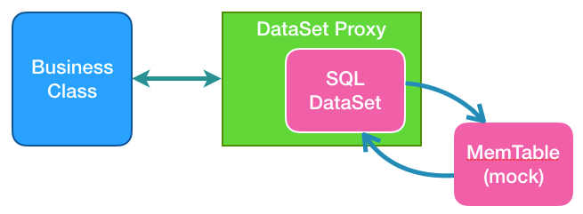
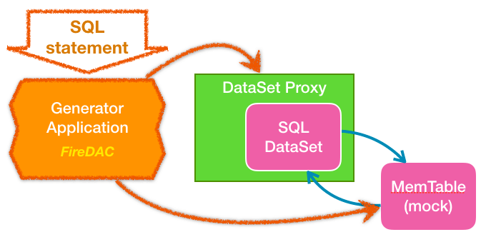

# DataProxy Pattern for Delphi


-------------------------------------------------------------------
## TBD in ver. 1.0 (plan)

Tasks:
1) Remove Generator App from main `README`
   - move to Generator App documentation to separate document
   - update diagrams
2) Merge [Using TProxyDataSet in action](https://github.com/bogdanpolak/delphi-dataproxy/blob/master/doc/using-proxy.md) with main README
3) Merge [TDataSet vs TDataSetProxy](https://github.com/bogdanpolak/delphi-dataproxy/blob/master/doc/compare-dataset-vs-proxy.md) with main README as introduction
4) Separate memory dataset generation as separate subject for unit testing
5) Describe TDataSetProxy as a tool for extracting logic form legacy projects
6) Separate two sections:
   * refactoring dataset into `TDataSetProxy`
   * inserting extracted code into unit test harness
7) Point [DataSet Generator](https://github.com/bogdanpolak/dataset-generator) as a supportive project
8) Remove `TDataProxyFactory` use `WithDataSet`
9) Update docs according to current folder structure:
   * `proxy` -> `src`
   * `generator` -> `tools\generator-app`
10) Expnlain fake datasets generator as supportive project
   * point source repo: https://github.com/bogdanpolak/dataset-generator


-------------------------------------------------------------------
## Overview

TDataSetProxy is a wrapper component for the TDataSet component (Delphi). The proxy allows to replace any dataset (TDataSet descendant) with a mock dataset - memory table. Solution can be used to separate a business class from  datasets during unit testing. Another use is to allow easy replacement of one DAC's components with another.



**Inspiration**. Idea is based on Proxy GoF pattern and Active Record pattern (from: Martin Fowler - Patterns of Enterprise Application Architecture). See article: [Evolving Toward a Persistence Layer by Patkos Csaba](https://code.tutsplus.com/tutorials/evolving-toward-a-persistence-layer--net-27138)

## Generator Application

The Generator application automatically creates Delphi source code based od sample SQL query (eg. SELECT statement). The project contains its source code (folder `/generator`). In current release the `Generator App` uses FireDAC to connect to RDBMS server and execute query, but it's possible to extend support to other Delphi DAC components (eg. AnyDAC). 



Main generator's goals are:
* Receive a SQL statement 
  * Connects to RDBMS database with `FireDAC`, paste, enter or edit a SQL statement
  * Checks a structure and data in the result data set
* Generate a proxy
  * Using a SQL statement structure creates a Delphi code with new DAO class based on the TProxyDataSet
* Generate a dataset mock `MemTable`
  * Creates a Delphi code which builds a `TFDMemTable` component with the same structure as the input dataset
  * Creates a Delphi code that clones data using the `Append` procedure
  
Supported Delphi versions: XE8, 10 Seattle, 10.1 Berlin, 10.2 Tokyo, 10.3 Rio

## Samples

Check `samples` subfolder

1) Books sample
    1) see the setup documentation: [Samples README](./samples/README.md)
    1) `TDatasetProxy` class source code is in the `/samples/base` folder
    1) Generated proxy = `TBookProxy` in (`Data.Proxy.Book.pas` unit)
    1) Generated mock factory = `function CreateMockTableBook` in (`Data.Mock.Book.pas` unit)

```pas
unit Data.Proxy.Book;

interface
uses
  Data.DB,
  Data.DataProxy;

type
  TBookProxy = class(Data.DataProxy.TDatasetProxy)
  private
    FISBN :TWideStringField;
    FTitle :TWideStringField;
    FReleseDate :TDateField;
    FPages :TIntegerField;
    FPrice :TBCDField;
  protected
    procedure ConnectFields; override;
  public
    property ISBN :TWideStringField read FISBN;
    property Title :TWideStringField read FTitle;
    property ReleseDate :TDateField read FReleseDate;
    property Pages :TIntegerField read FPages;
    property Price :TBCDField read FPrice;
  end;
  ...
```
[... more code - Gist sample (Data.Proxy.Book.pas)](https://gist.github.com/bogdanpolak/b13f0c5a677c3401734918dbfa7ae755)

```pas
unit Data.Mock.Book;

interface

uses
  System.Classes, System.SysUtils,
  Data.DB,
  FireDAC.Comp.Client;

function CreateMemDataSet_Book(AOwner: TComponent): TDataSet;

implementation

function CreateMemDataSet_Book(AOwner: TComponent): TDataSet;
var
  ds: TFDMemTable;
begin
  ds := TFDMemTable.Create(AOwner);
  with ds do
  begin
    FieldDefs.Add('ISBN', ftWideString, 20);
    FieldDefs.Add('Title', ftWideString, 100);
    FieldDefs.Add('ReleseDate', ftDate);
    FieldDefs.Add('Pages', ftInteger);
    with FieldDefs.AddFieldDef do begin
      Name := 'Price';  DataType := ftBCD;  Precision := 12;  Size := 2;
    end;
    CreateDataSet;
  end;
  with ds do
  begin
    Append;
    FieldByName('ISBN').Value := '978-0131177055';
    FieldByName('Title').Value := 'Working Effectively with Legacy Code';
    FieldByName('ReleseDate').Value := EncodeDate(2004,10,1);
    FieldByName('Pages').Value := 464;
    FieldByName('Price').Value := 52.69;
    Post;
  end;
  // ... more rows appended here ...
  Result := ds;
end;
```
[... more code - Gist sample (Data.Mock.Book.pas)](https://gist.github.com/bogdanpolak/1622fcc3e4f1185fb4ead8263c9b8b31)

## Documentation

1. [Proxy Generator User Guide](doc/generator-guide.md)
1. [Using TProxyDataSet in the project](doc/using-proxy.md) *(in progress)*
1. [Why using TDataSetProxy](./doc/compare-dataset-vs-proxy.md)
